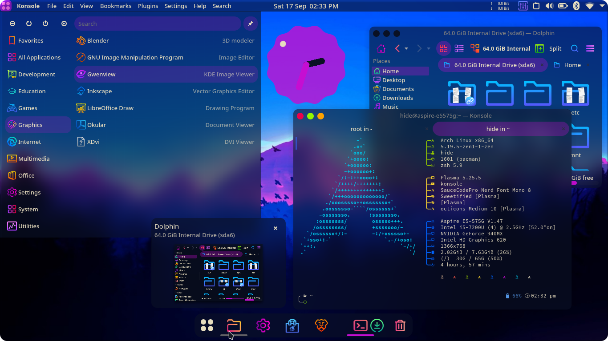
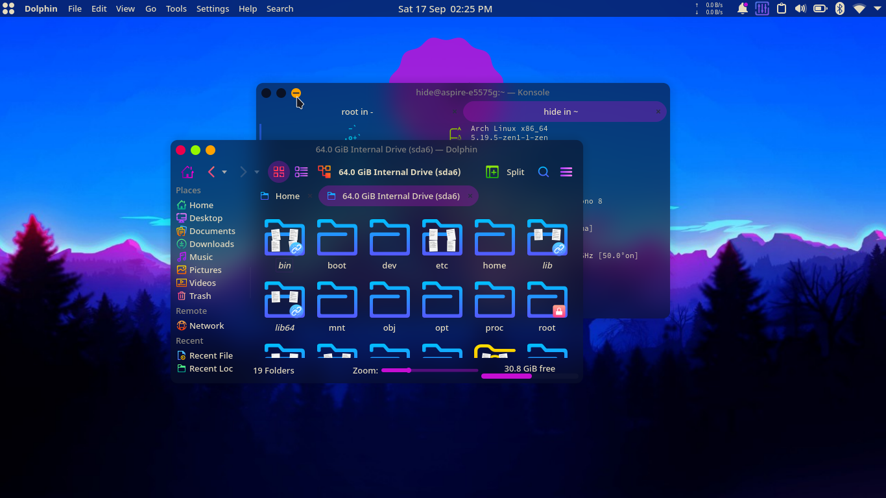
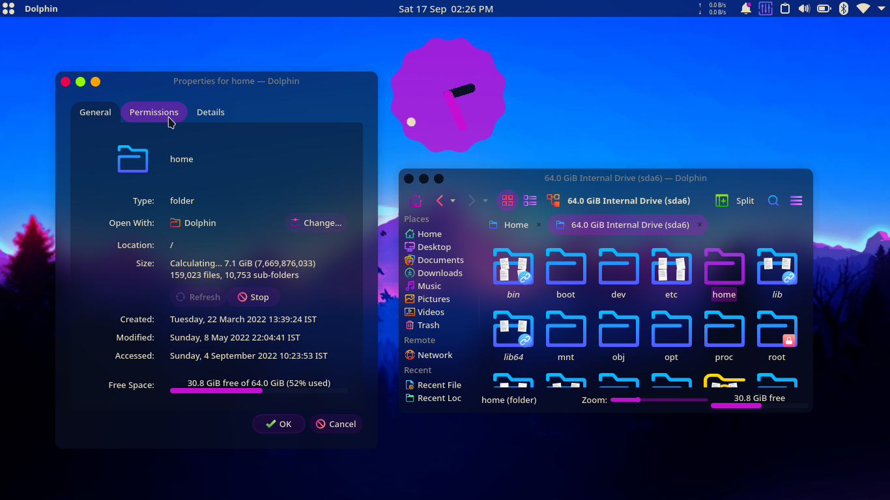
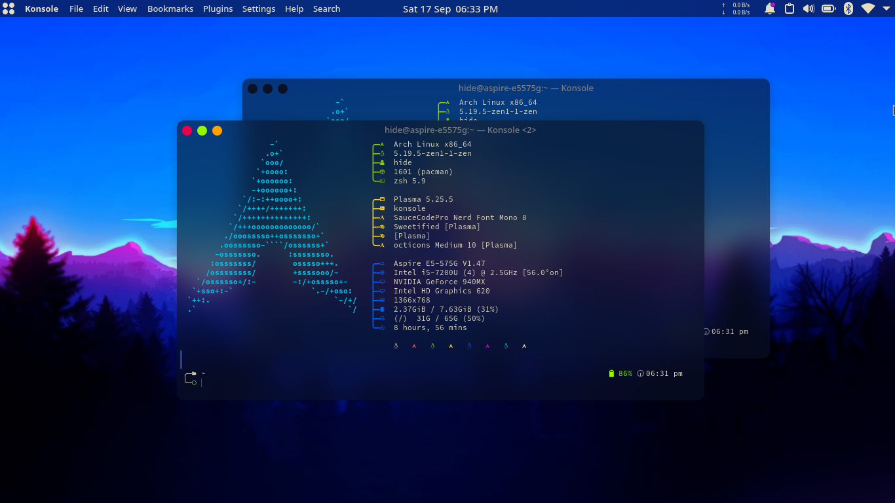
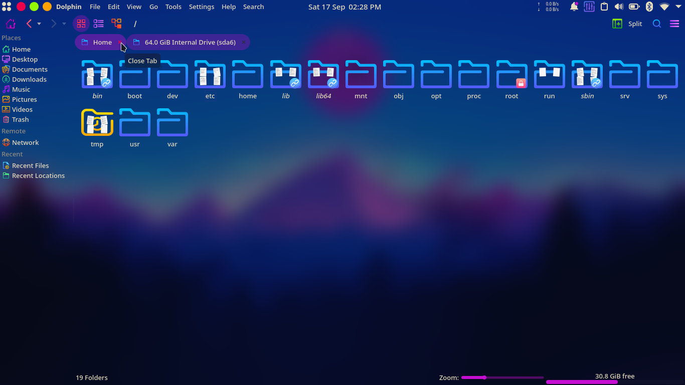
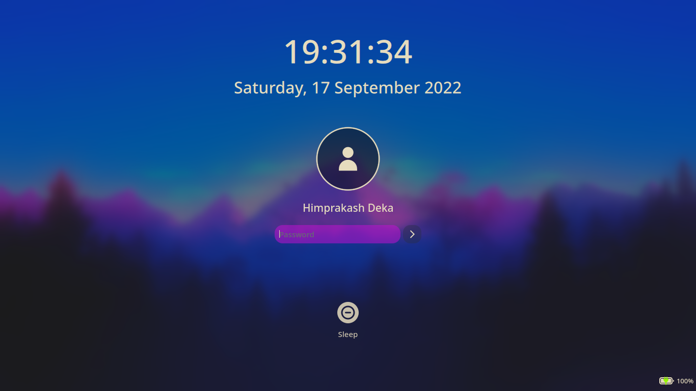

<a href="https://himdek.com/Utterly-Sweet-Plasma/">
 
 <h1 align="center">Utterly Sweet Plasma Global Theme</h1>
 </a>
 
A Dark Bluish and Blurry Global theme for Plasma 5

 
 
 
 
 
 
 

  
   
  
  

A Global theme for Plasma 5 with transparency, blur, rounded edges for UI elements, [Beauty line Icons](https://store.kde.org/p/1425426/) icons, a dark bluish color scheme and a reasonable desktop layout with a top panel, dock and a Android 12 like clock widget.

## Key features:

* Window decoration blends with Window background when appropriate Kvantum theme and Konsole Color Scheme is used
* Rounded edges for all UI elements and window borders
* MacOS inspired desktop layout with a dock and a top panel that contains window buttons, global menu, [NetSpeed Widget](https://store.kde.org/p/998895/) and more
* [Simple Kickoff](https://github.com/HimDek/Simple-Kickoff-for-Plasma) in top panel and [Better Kicker Dash](https://github.com/HimDek/Better-Kicker-Dash-for-Plasma) in dock
* Android 12 like Material You clock widget
* Supports transparency: Go to `System Settings > Workspace Behavior > Desktop Effects` and enable `Blur`, `Background Contrast` and `Tranlucency` for best result.

## Prerequisites:

* Linux based Operating System
* [KDE Plasma 5 Desktop Environment](https://kde.org/plasma-desktop/)

<h1 align="center">Get it from</h1>

  
  
  

* **NOTE:** Installing the global theme package from any one of the above sources will also install all of its required components except the `Utterly Sweet Konsole Color Scheme` and the `Utterly Sweet Kvantum Theme`.
  * Please install the `Utterly Sweet Konsole Color Scheme` by opening Konsole and going to `Settings > Edit Current Profile... > Appearance > Get New...` and searching for `Utterly Sweet`,
  * The `Utterly Sweet Kvantum Theme` by following the instructions [here](https://store.kde.org/p/1906474/)

<h1 id="gallery" align="center">Gallery</h1>

  

  

  

  

  

  

